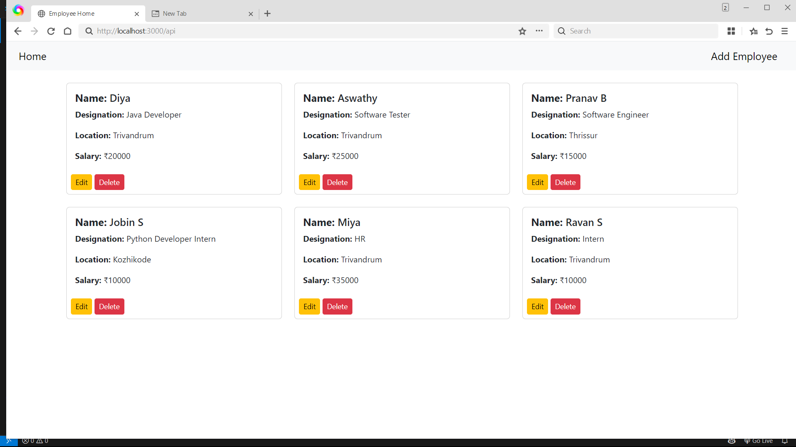
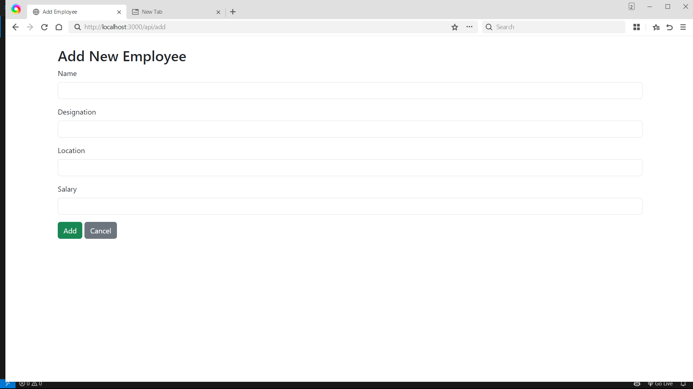
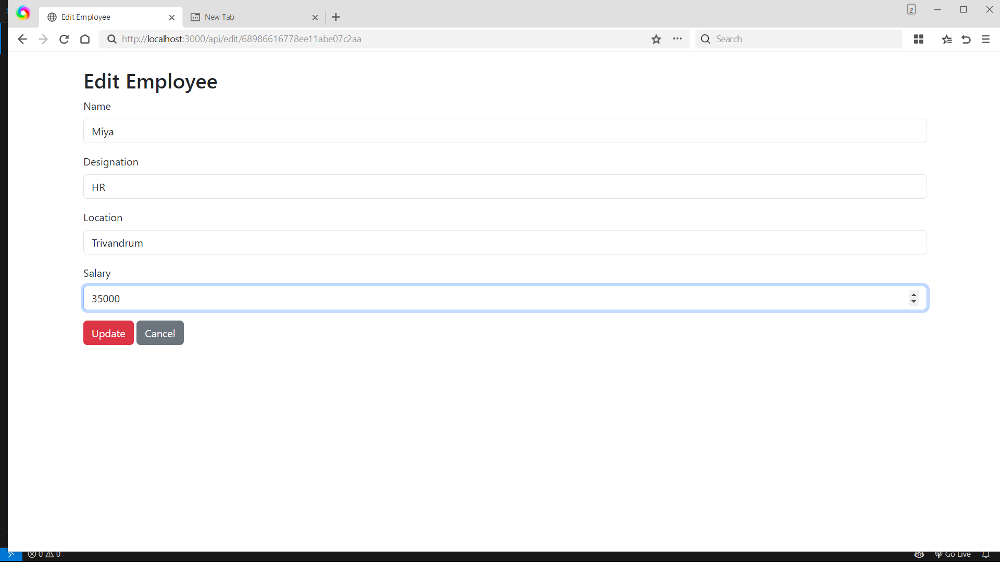
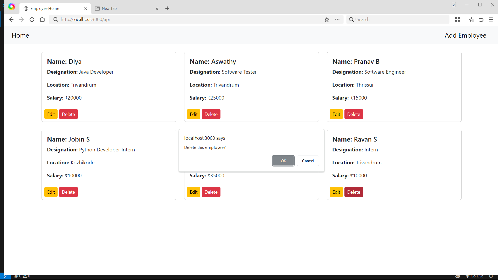

📌 Overview
This is an Employee Management Application where the frontend is developed using EmbeddedJS (EJS) and the backend is built with Node.js, Express.js, and MongoDB.
The app allows users to view, add, update, and delete employees in a database.

📂 Features
Home Page: Displays all employees in card from MongoDB.

Add Employee: Form to add a new employee and save it in the database.

Update Employee: Edit existing employee details.

Delete Employee: Remove an employee from the database.

Navigation Bar: Easily switch between Home and Add Employee pages.

🛠 Tech Stack

Frontend: EmbeddedJS (EJS), HTML, CSS

Backend: Node.js, Express.js

Database: MongoDB

 📂 Folder Structure

 EMPLOYEEAPPBACKEND/
│
├── models/
│ └── employeemodel.js
│
├── routes/
│ └── employeeroutes.js
│
├── views/
│ ├── addemployee.ejs
│ ├── edit.ejs
│ └── home.ejs
│
├── connection.js
├── app.js
├── .env
├── package.json
├── package-lock.json
└── README.md

 ⚙ Installation

1. **Clone the repository**
```bash
git clone https://github.com/yourusername/employee-app.git
cd employee-app

2️⃣ Install dependencies

npm install

3️⃣ Set up environment variables in .env

MONGO_URL=your_mongodb_atlas_connection_string
PORT=3000

4️⃣ Run the server

node app.js

or with 

npx nodemon app.js

🌐 Usage
Open your browser and go to:

http://localhost:3000

📸 Screenshots







